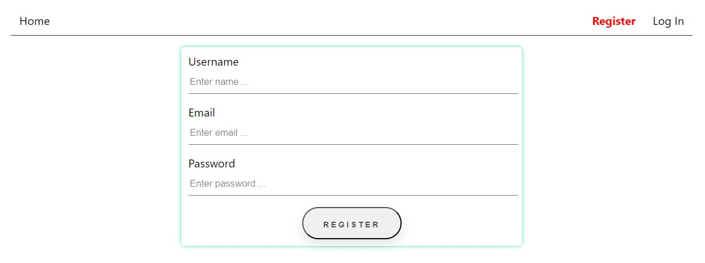
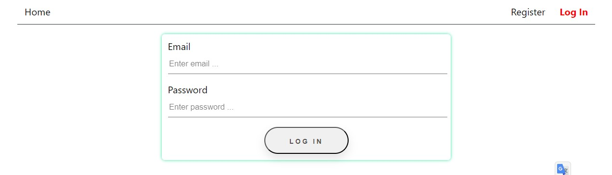
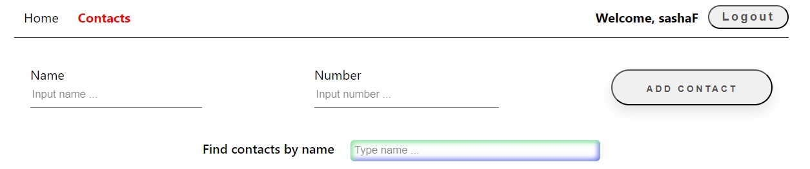
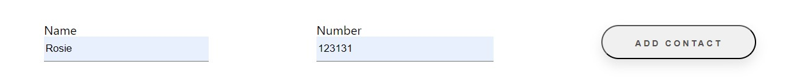
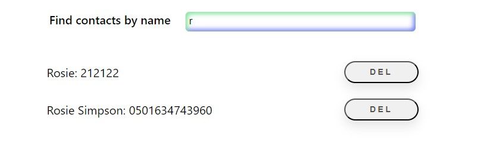

# PHONEBOOK

A phone book that has user registration and login. After registration, access to
add contacts is provided. After user authorization, the contact book saved by
the user opens. In the contact book, you can add contacts, delete contacts, and
filter the list of contacts by name.

Follow the link to view the site
[PHONEBOOK](https://denshykyta.github.io/goit-react-hw-08-phonebook/)

##

##

##

##

## Technologies

- JavaScript
- css modules
- React
- react-redux
- redux-toolkit
- react-router-dom
- redux-persist
- asyncThunk
- axios
- notiflix
- gitHub Desktop
- gitHub
